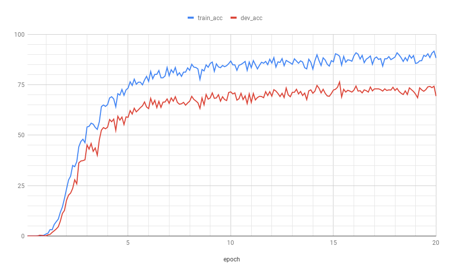
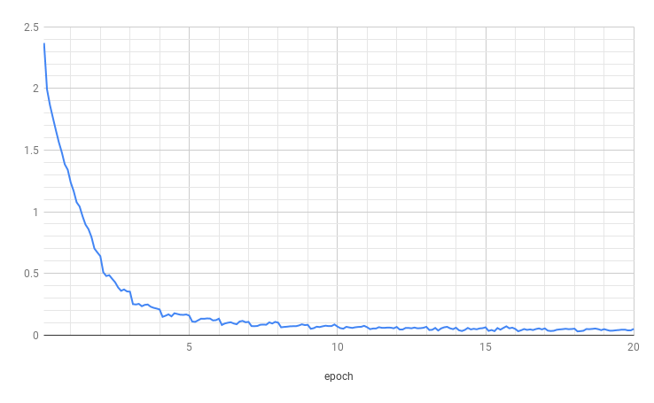

# morphological-inflection-practice
This repository is for me to practice implementing seq2seq models with attention in PyTorch while solving the CoNLL-SIGMORPHON 2017 morphological inflection shared task

## Seq2Seq Model
Here are the train/dev-accuracy and train-loss graphs for English:
 
